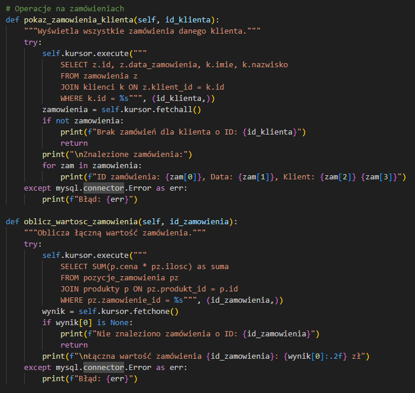

# System zarządzania sklepem komputerowym

## Instalacja i uruchomienie

### 1. Wymagania:
- Python 3.x ([pobierz](https://www.python.org/downloads/))
- MySQL Server

### 2. Instalacja bibliotek Python:
```batch
pip install mysql-connector-python
pip install colorama
```

### 3. Konfiguracja bazy danych:

1. Uruchom MySQL Shell:
```batch
mysql -u root -p
```

2. Utwórz i skonfiguruj bazę:
```sql
CREATE DATABASE sklep CHARACTER SET utf8mb4 COLLATE utf8mb4_unicode_ci;
USE sklep;
```

3. Importuj schemat bazy (w nowym oknie terminala):
```batch
mysql -u root -p sklep < baza_sklep.sql
```

### 4. Uruchomienie aplikacji:
```batch
python sklep.py
```

> **Uwaga**: 
> - Domyślne dane logowania: użytkownik root (bez hasła)
> - Jeśli ustawiono hasło, należy je podać przy poleceniach mysql
> - Upewnij się, że usługa MySQL jest uruchomiona

## 1. Instalacja bibliotek

```python
def sprawdz_biblioteki():
    """Sprawdza i instaluje wymagane biblioteki."""
    wymagane_biblioteki = {
        'mysql-connector-python': 'mysql.connector',
        'colorama': 'colorama'
    }
    
    for paczka, nazwa_importu in wymagane_biblioteki.items():
        if importlib.util.find_spec(nazwa_importu) is None:
            print(f"Instalowanie biblioteki {paczka}...")
            try:
                subprocess.check_call([sys.executable, "-m", "pip", "install", paczka])
                print(f"Biblioteka {paczka} została zainstalowana pomyślnie!")
            except subprocess.CalledProcessError:
                print(f"Błąd podczas instalacji {paczka}!")
                exit(1)

# Sprawdzenie i instalacja bibliotek
sprawdz_biblioteki()
```

## 2. Połączenie z bazą danych 

```python
class BazaDanych:
    """Klasa obsługująca operacje na bazie danych sklepu."""
    
    def __init__(self):
        """Inicjalizacja połączenia z bazą danych."""
        try:
            self.polaczenie = mysql.connector.connect(
                host="localhost",
                user="root",
                password="",
                database="sklep"
            )
            self.kursor = self.polaczenie.cursor()
        except mysql.connector.Error as err:
            print(f"Błąd połączenia: {err}")
            exit(1)
```

## 3. Zarządzanie klientami


Funkcje do wyświetlania i wyszukiwania klientów w systemie.

## 4. Obsługa zamówień


Implementacja funkcji do zarządzania zamówieniami i obliczania ich wartości.

## 5. Eksport danych


System eksportu danych z bazy do plików CSV.

## 6. Menu główne


Implementacja interaktywnego menu użytkownika.

## 7. Struktura programu


Kompletna struktura aplikacji z podziałem na moduły.

## Autor
[Klein Patryk]
