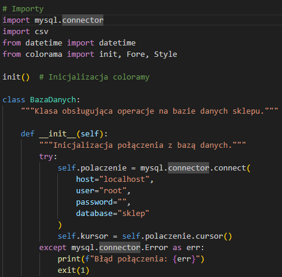
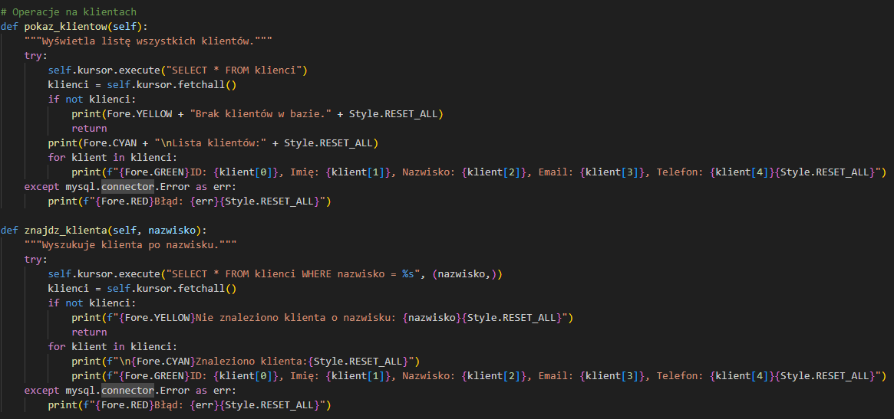
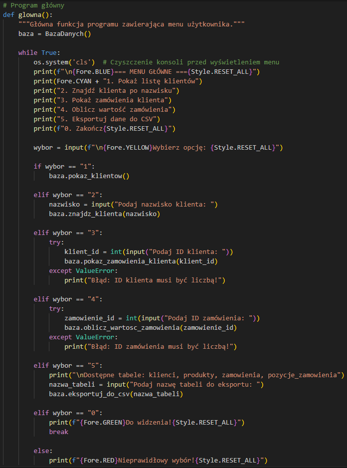

# System zarządzania sklepem komputerowym

## 1. Instalacja bibliotek

```python
def sprawdz_biblioteki():
    """Sprawdza i instaluje wymagane biblioteki."""
    wymagane_biblioteki = {
        'mysql-connector-python': 'mysql.connector',
        'colorama': 'colorama'
    }
    
    for paczka, nazwa_importu in wymagane_biblioteki.items():
        try:
            if importlib.util.find_spec(nazwa_importu) is None:
                print(f"Instalowanie biblioteki {paczka}...")
                subprocess.check_call([sys.executable, "-m", "pip", "install", paczka])
                print(f"Biblioteka {paczka} została zainstalowana pomyślnie!")
        except (ImportError, subprocess.CalledProcessError) as e:
            print(f"Błąd podczas instalacji {paczka}: {str(e)}")
            exit(1)

# Sprawdzenie i instalacja bibliotek
sprawdz_biblioteki()
```

## 2. Funkcje systemowe
Program wykorzystuje następujące funkcje systemowe:
- Automatyczne czyszczenie konsoli (`cls`) dla lepszej czytelności
- Kolorowe komunikaty dzięki bibliotece colorama
- Obsługa błędów i wyjątków

## 3. Połączenie z bazą danych 

```python
class BazaDanych:
    """Klasa obsługująca operacje na bazie danych sklepu."""
    
    def __init__(self):
        """Inicjalizacja połączenia z bazą danych."""
        try:
            self.polaczenie = mysql.connector.connect(
                host="localhost",
                user="root",
                password="",
                database="sklep"
            )
            self.kursor = self.polaczenie.cursor()
        except mysql.connector.Error as err:
            print(f"Błąd połączenia: {err}")
            exit(1)
```

## 4. Zarządzanie klientami

Funkcje do wyświetlania i wyszukiwania klientów w systemie.

## 5. Obsługa zamówień

Implementacja funkcji do zarządzania zamówieniami i obliczania ich wartości.

## 6. Eksport danych

System eksportu danych z bazy do plików CSV.

## 7. Menu główne

Implementacja interaktywnego menu użytkownika z automatycznym czyszczeniem ekranu.

## 8. Struktura programu

Kompletna struktura aplikacji z podziałem na moduły:
- Obsługa bibliotek
- Zarządzanie konsolą
- Operacje bazodanowe
- Interfejs użytkownika

## Instalacja i uruchomienie

1. Wymagania systemowe:
- Python 3.x
- MySQL Server
- System Windows (dla funkcji czyszczenia konsoli)

2. Instalacja zależności:
Program automatycznie zainstaluje wymagane biblioteki przy pierwszym uruchomieniu.
Można też zainstalować je ręcznie:
```bash
pip install mysql-connector-python colorama
```

3. Import schematu bazy danych:
```sql
source baza_sklep.sql
```

4. Uruchomienie aplikacji:
```bash
python sklep.py
```

## Autor
[Twoje imię i nazwisko]

## Licencja
MIT License
