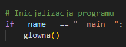

# System zarządzania sklepem komputerowym

## Instalacja i uruchomienie

1. Wymagania systemowe:
- Python 3.x
- MySQL Server

2. Instalacja zależności:
Program automatycznie zainstaluje wymagane biblioteki przy pierwszym uruchomieniu.
Jedynie jedna biblioteka musi być pobrana ręcznie:
```bash
pip install psutil
```

3. Import schematu bazy danych:
```sql
CREATE DATABASE sklep CHARACTER SET utf8mb4 COLLATE utf8mb4_polish_ci;
exit

mysql -u root -p sklep < skiezka_do_bazy_sklep.sql
```

4. Uruchomienie aplikacji:
```bash
python sklep.py
```

## Demonstracja wideo
](https://www.youtube.com/watch?v=FTWF1_VwDFs)

## 1. Instalacja bibliotek

```python
def sprawdz_biblioteki():
    """Sprawdza i instaluje wymagane biblioteki."""
    wymagane_biblioteki = {
        'mysql-connector-python': 'mysql.connector',
        'colorama': 'colorama'
    }
    
    for paczka, nazwa_importu in wymagane_biblioteki.items():
        try:
            if importlib.util.find_spec(nazwa_importu) is None:
                print(f"Instalowanie biblioteki {paczka}...")
                subprocess.check_call([sys.executable, "-m", "pip", "install", paczka])
                print(f"Biblioteka {paczka} została zainstalowana pomyślnie!")
        except (ImportError, subprocess.CalledProcessError) as e:
            print(f"Błąd podczas instalacji {paczka}: {str(e)}")
            exit(1)

# Sprawdzenie i instalacja bibliotek
sprawdz_biblioteki()
```

## 2. Połączenie z bazą danych 

```python
class BazaDanych:
    """Klasa obsługująca operacje na bazie danych sklepu."""
    
    def __init__(self):
        """Inicjalizacja połączenia z bazą danych."""
        try:
            self.polaczenie = mysql.connector.connect(
                host="localhost",
                user="root",
                password="",
                database="sklep"
            )
            self.kursor = self.polaczenie.cursor()
        except mysql.connector.Error as err:
            print(f"Błąd połączenia: {err}")
            exit(1)
```

## 3. Zarządzanie klientami


Funkcje do wyświetlania i wyszukiwania klientów w systemie.

## 4. Obsługa zamówień


Implementacja funkcji do zarządzania zamówieniami i obliczania ich wartości.

## 5. Eksport danych


System eksportu danych z bazy do plików CSV.

## 6. Menu główne


Implementacja interaktywnego menu użytkownika z automatycznym czyszczeniem ekranu.

## 7. Inicjalizacja programu


Prosta lecz wygodna inicjalizacja programu

## Autor
[Patryk Klein]
